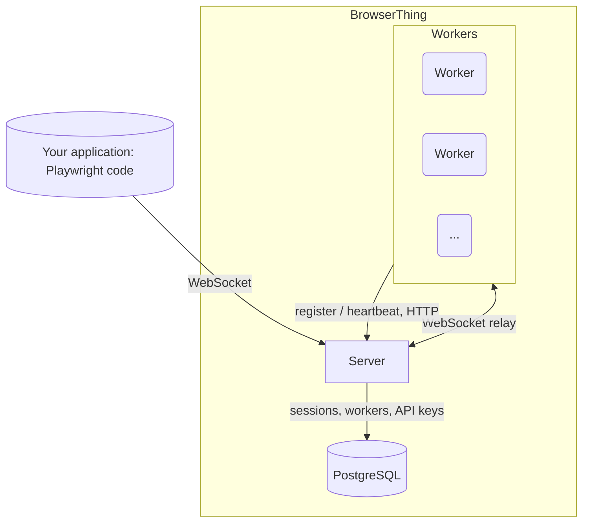

<h1 align="center">BrowserThing</h1>

<p align="center">
  <strong>Use Playwright in your app. Run browsers elsewhere.</strong><br/>
  A self-hosted browser pool for <a href="https://playwright.dev/">Playwright</a> applications. Reuse running browsers for short tasks, with session cleanup and configurable browser recycling.
</p>

<p align="center">
  <a href="https://github.com/mbroton/browserthing/actions/workflows/ci.yml"></a>
  <a href="LICENSE"></a>
</p>

---

[Website](https://mbroton.github.io/browserthing/) ·
[Documentation](https://mbroton.github.io/browserthing/docs/)

BrowserThing was built for applications that run many short browser tasks.
Starting a new browser for every task adds time and CPU use. Keeping the same
browser running indefinitely can let memory use grow or leave it in a bad state.
BrowserThing reuses running browsers across tasks and replaces them after a
configurable number of sessions.

Write normal Playwright code in your application and connect through one
WebSocket endpoint. BrowserThing selects an available worker and cleans up each
session when its connection closes. Your team deploys and updates the service.

Run workers on separate machines to keep browser CPU and memory use off your
application servers. Add workers when you need more browser capacity.

```text
Your application                 BrowserThing
Playwright commands ---------->  Browser workers
Results             <----------  Browsers stay running
```

The pool is built for your own applications and trusted clients. Browser contexts
separate cookies and storage, but sessions share a browser process on each worker.
See the [security boundary](#security-boundary).

BrowserThing was previously named `playwright-distributed`.
For existing installations, see [upgrading after the rename](#upgrading-after-the-rename).

## Quick start

You need Docker with the Compose plugin, `curl`, and Node.js 20 or later.

**1. Start the service** — the server, PostgreSQL, and one Chromium worker:

```bash
curl -LO https://raw.githubusercontent.com/mbroton/browserthing/main/docker-compose.yaml
curl --create-dirs -o worker/seccomp_profile.json https://raw.githubusercontent.com/mbroton/browserthing/main/worker/seccomp_profile.json
docker compose up -d
```

**2. Install the Playwright client.** The current release uses Playwright `1.63.0`:

```bash
npm init -y
npm install playwright@1.63.0
```

**3. Run a browser task.** Save this as `browser-task.mjs`. This example saves
a screenshot. Replace the task with the browser actions your application needs:

```js
import { chromium } from 'playwright';

const browser = await chromium.connect('ws://localhost:8080');
try {
  const context = await browser.newContext();
  const page = await context.newPage();
  await page.goto('https://example.com');
  await page.screenshot({ path: 'preview.png', fullPage: true });
} finally {
  await browser.close();
}
```

Run the example:

```bash
node browser-task.mjs
```

The client saves `preview.png` locally. BrowserThing releases the session's
resources when the connection closes, so the browser can serve the next task.
This local setup runs workers on your machine. Use
[separate worker hosts](worker/README.md#scaling-beyond-one-machine) to move
browser resource use off your application server.

> Your client's Playwright `major.minor` version must match a registered
> worker's version — the server routes each client to a version-matched
> worker.

When you need more browser capacity, add workers. Each
serves up to `MAX_SLOTS` (default 5,
[how to tune it](worker/README.md)) concurrent sessions:

```bash
docker compose up -d --scale worker=5    # 25 session slots
```

For Firefox or WebKit, add a worker service with `BROWSER_TYPE=firefox` or
`BROWSER_TYPE=webkit` (copy the `worker` service in the compose file; see
`docker-compose.local.yaml` in the repository for a three-browser stack) and
connect with `firefox.connect('ws://host:8080/?browser=firefox')`.

## What you get

- **Playwright in your application.** Use the usual API from Node.js, Python,
  Java, or .NET through one endpoint. Workers support Chromium, Firefox, and WebKit.
- **Browsers ready between tasks.** Reuse running browsers to avoid launching
  a browser for every task.
- **Separate browser capacity.** Run workers on their own hosts and add capacity
  without adding application instances.
- **Browser management in one service.** Workers handle session cleanup and
  browser recycling. Applications close their connections when work is done.
- **Your infrastructure.** Deploy the service on your own machines under the
  Apache-2.0 license.

## One browser service for your applications

Keep the steps of each browser task in your application code. Use Playwright to
navigate pages, interact with them, and use the results in your application.
Connect when a task needs a browser and close the connection when it finishes.
BrowserThing selects a worker and handles browser startup, cleanup, and recycling.

Several applications can share the same internal service. Browser capacity and
updates are managed in one place, separate from each application's code.

## Warm browsers vs a browser per session

Browser startup adds time and CPU use to short tasks. BrowserThing keeps browsers
running between connections. In this benchmark, each task opened and closed a
Playwright connection, and Browserless 2.56.0 launched a new browser process for
each connection. The comparison used an AWS `m8i.xlarge` (4 vCPUs, 16 GB), the
same Playwright version, one BrowserThing worker, and one Browserless node:

| | BrowserThing | Browserless |
|---|---|---|
| Get a browser, open a page, read it | **51 ms** | 217 ms |
| CPU used per task | **0.09 s** | 0.70 s |
| 1,000 such tasks, 5 at a time | **26 s** | 154 s |

These results measure a short page-read task.
They show the overhead saved when tasks open and close connections frequently.
Browserless also supports session reuse, which this benchmark did not use. See
[benchmark details](https://mbroton.github.io/browserthing/docs/benchmarks/).
Measure your own pages to estimate the benefit for your application.

Sessions use separate browser contexts for cookies and storage, but share the
browser process on each worker:

- Browser contexts do not provide a separate operating system boundary for each
  session. See [Security boundary](#security-boundary).
- Browser command-line flags are set when the worker starts, so one session
  cannot bring its own — say, a browser extension — the way a
  freshly-launched browser can. Per-session proxy, locale, viewport, and
  cookies work as usual via contexts.
- If the shared browser crashes, all sessions on that worker end with it.
  BrowserThing restores capacity; your application decides whether to retry
  the task.

## Architecture



- **The server** is a single Go binary: it authenticates clients, picks a
  worker, relays the WebSocket bytes, and exposes a REST API for sessions,
  workers, and capacity.
- **Workers** are containers built on the official Playwright image. Each
  keeps one browser running and serves up to `MAX_SLOTS` concurrent
  sessions; every session creates its own isolated contexts on that browser.
- **PostgreSQL** holds all durable state: sessions, workers, and API keys
  are rows. Sessions of dead workers are closed out automatically, so
  capacity recovers without intervention.
- **Recycling**: after a configurable number of sessions, a worker drains
  and replaces its browser without restarting the container. Sessions still
  running after `DRAIN_TIMEOUT` are closed. Selection concentrates load on the
  longest-serving worker, so recycles tend to happen one worker at a time.

## Production deployment

Run the server, PostgreSQL, and workers as independent services (Docker or
Kubernetes):

- **Networking**: workers → server (HTTP: register, heartbeat), server →
  workers (WebSocket dial), server → PostgreSQL.
- **Exposure**: keep PostgreSQL and workers private; expose only the server.
- **Authentication**: a server with zero API keys runs in open bootstrap
  mode. Create the first key
  (`docker compose exec server server apikey create --name <name>`) and from
  then on every request except health checks needs a key; hand it to every
  worker (`WORKER_API_KEY`) and client
  (`chromium.connect('ws://host:8080/?token=pwd_...')`) in the same step.
- **Scaling**: add or remove worker containers freely; each registers itself
  and starts serving. Workers can run on other machines — see
  [scaling beyond one machine](worker/README.md#scaling-beyond-one-machine).

See [`server/README.md`](server/README.md) for the full configuration and
API reference.

### Upgrading after the rename

The container image paths are now
`ghcr.io/mbroton/browserthing/server` and
`ghcr.io/mbroton/browserthing/worker`. Existing images under
`ghcr.io/mbroton/playwright-distributed/` remain available, but new releases
use only the `browserthing` paths. Update your image references to receive
future releases.

Keep your existing `.env` file and Compose project name when upgrading.
If you rename the deployment directory, first find the existing project name
with `docker compose ls`, then set `COMPOSE_PROJECT_NAME=<existing-name>` in
`.env`. This keeps Compose connected to the existing PostgreSQL volume.

The rename does not change the database name or user (`pwd`), API key format
(`pwd_...`), or worker session header (`x-pwd-session-id`). Existing keys and
server/worker connections remain compatible. Client and worker Playwright
versions must still match as described in the quick start.

### Security boundary

BrowserThing is built for applications you trust. It trusts every authenticated
client (in bootstrap mode: every client that can reach the server) while letting
browsers visit untrusted pages. The
compose files bind the server to `127.0.0.1`, keep PostgreSQL and workers on
an internal network, and run workers as a non-root user with Playwright's
Chromium sandbox profile.

An API key grants full browser and control-plane access, and authentication
does not encrypt plain `http://`/`ws://` traffic — put the server behind a
TLS reverse proxy, VPN, or private network. Containers are hardening, not a
strong isolation boundary against hostile tenants or browser exploits; use
dedicated VMs where that boundary is required. See
[Playwright's Docker security guidance](https://playwright.dev/docs/docker).

## Usage examples

### Python

```python
from playwright.async_api import async_playwright
import asyncio

async def main():
    async with async_playwright() as p:
        browser = await p.chromium.connect('ws://localhost:8080')
        try:
            context = await browser.new_context()
            page = await context.new_page()
            await page.goto('https://example.com')
            await page.screenshot(path='preview.png', full_page=True)
        finally:
            await browser.close()

asyncio.run(main())
```

### Sessions over REST

Create a session through the API to get an ID you can inspect, connect to,
and terminate:

```bash
curl -s localhost:8080/v1/capacity               # slots and queue depth
curl -s localhost:8080/v1/workers                # the whole grid

# Create a session, then connect to it by ID:
curl -s -X POST localhost:8080/v1/sessions \
  -H 'Content-Type: application/json' \
  -d '{"browser": "chromium", "playwright_version": "1.63.0"}'
# -> { "id": "..." }  connect: chromium.connect('ws://localhost:8080/sessions/<id>')

curl -s localhost:8080/v1/sessions/<id>          # inspect it
curl -X DELETE localhost:8080/v1/sessions/<id>   # terminate it, even mid-use
```

## Contributing

Bugs and ideas are welcome — open an issue. Code changes should start as an
issue too, so the approach is agreed on before anyone writes it.

## License

[Apache-2.0](LICENSE).
